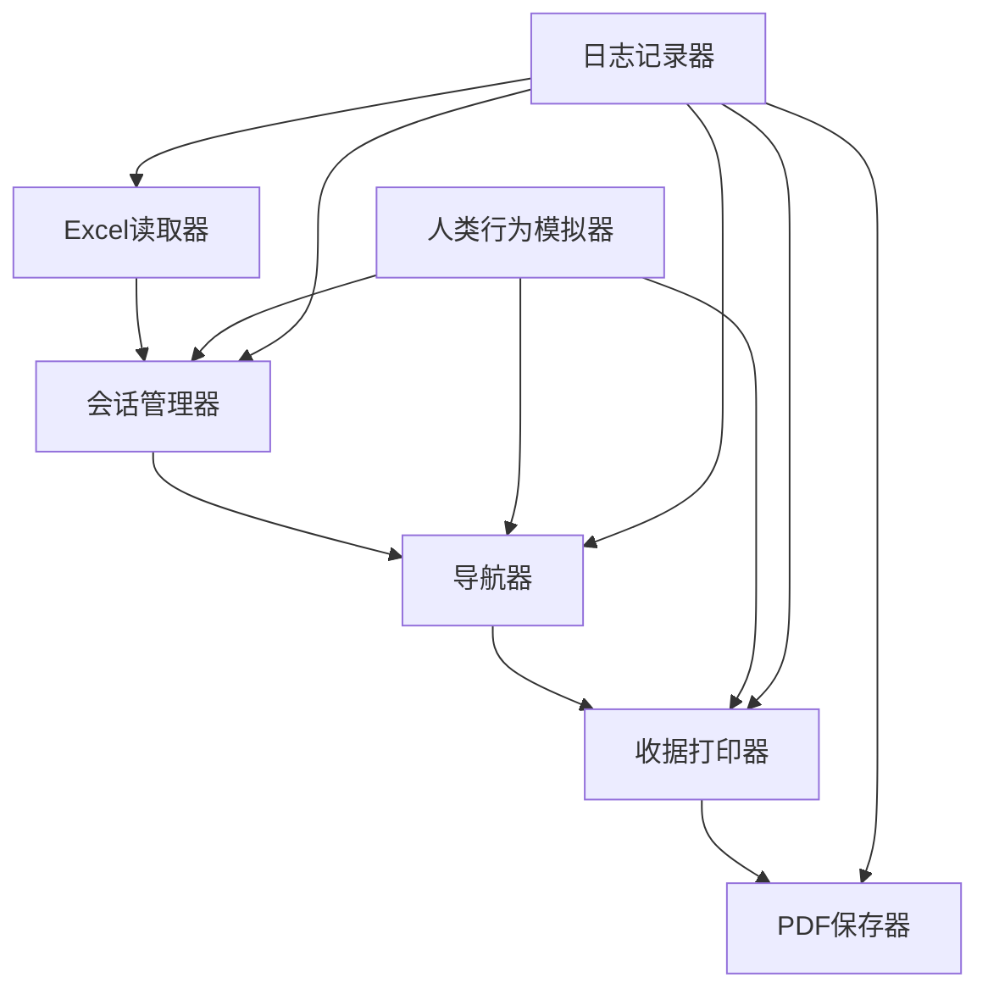
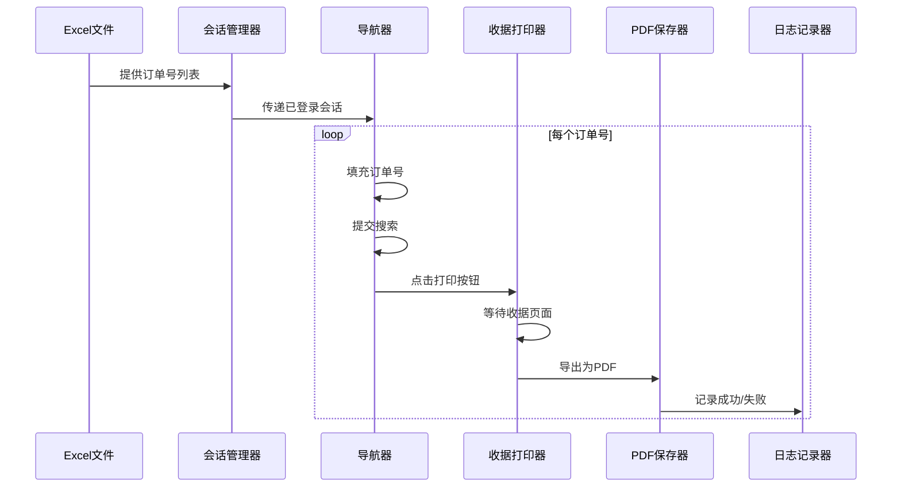

# 系统模式

## 架构概述
订单PDF安全下载工具采用模块化架构，以任务管道式执行流程设计。系统主要由以下几个核心模块组成：

## 核心模块设计

### 1. Excel读取器 (excel_reader.py)
- 职责：读取Excel文件中的提单号
- 设计模式：工厂模式，支持读取不同格式的Excel文件
- 关键技术：pandas库，支持多Sheet读取，定位F列数据

### 2. 会话管理器 (session_manager.py)
- 职责：管理浏览器会话，处理登录状态
- 设计模式：单例模式，确保全局只有一个会话实例
- 关键技术：Playwright状态持久化，会话复用

### 3. 导航器 (navigator.py)
- 职责：页面导航，元素定位，表单填写
- 设计模式：命令模式，将页面操作封装为命令对象
- 关键技术：CSS选择器，XPath定位，页面等待策略

### 4. 收据打印器 (receipt_printer.py)
- 职责：触发打印按钮，监听新页面，处理PDF导出
- 设计模式：观察者模式，监听页面变化
- 关键技术：Playwright多页面管理，PDF导出

### 5. 人类行为模拟器 (humanizer.py)
- 职责：模拟人类操作，随机延迟，自然交互
- 设计模式：装饰器模式，为各操作添加人类特征
- 关键技术：随机延迟算法，鼠标轨迹模拟

## 数据流设计

## 技术决策说明

### 选择Playwright而非Selenium的原因
- 更现代的浏览器自动化API
- 更好的异步支持
- 内置的等待机制更稳定
- 更强大的网络请求拦截能力
- 更简单的状态持久化

### 使用非Headless模式的原因
- 提高与目标网站的兼容性
- 方便调试和监控执行过程
- 降低被网站检测为自动化工具的风险

### 模块化设计的好处
- 便于测试单个组件
- 提高代码可维护性
- 支持后续功能扩展
- 便于处理特定模块的异常

## 安全考量
- 使用配置文件分离敏感信息
- 实现请求频率限制
- 模拟人类行为减少被检测风险
- 会话复用减少登录频率 